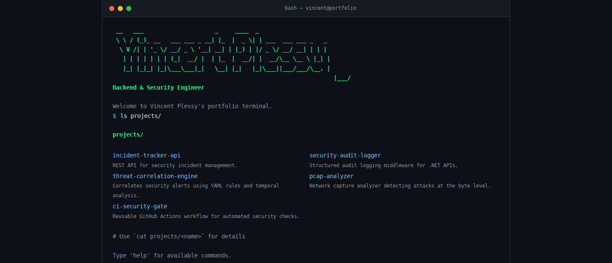

# Vincent Plessy — Terminal Portfolio

A single-page interactive terminal portfolio built with vanilla HTML, CSS, and JavaScript. No frameworks, no templates — just the raw web platform.

## Preview

The locally served portfolio after entering `ls projects/` in its terminal interface.

## Live URL

https://vincent-p-essy.github.io

## Available Commands

| Command | Description |
|---|---|
| `help` | Show all available commands |
| `whoami` | About Vincent Plessy |
| `ls projects/` | List all projects |
| `cat projects/<name>` | Show project details |
| `open <name>` | Alias for `cat projects/<name>` |
| `ls skills/` | List skill categories |
| `cat skills/<category>` | Show skills for a category |
| `contact` | Email & social links |
| `banner` | Display ASCII art banner |
| `echo <text>` | Print text to terminal |
| `clear` | Clear the terminal |

Keyboard shortcuts: `↑` / `↓` history navigation, `Tab` completion, `Ctrl+L` clear.

## Stack

- HTML5 (semantic, accessible)
- CSS3 (custom properties, grid, flexbox, animations)
- Vanilla JavaScript (ES6+, no dependencies)
- JetBrains Mono / Fira Code via Google Fonts

## Deploy on GitHub Pages

1. Go to **Settings → Pages** in the repository.
2. Under **Source**, select the `main` branch and `/ (root)` folder.
3. Click **Save**. GitHub will publish the site to `https://vincent-p-essy.github.io`.

## Screenshot

What you should see when the page loads:
- A dark terminal window (background `#0d1117`) with a macOS-style title bar at the top showing three colored dots (red, yellow, green) and the text `bash — vincent@portfolio`.
- An animated ASCII art banner in green spelling out "Vincent Plessy".
- A typewriter welcome message followed by an auto-run `whoami` command.
- A blinking green cursor in the input line waiting for your next command.

## Author

Vincent Plessy — [GitHub](https://github.com/Vincent-P-essy)
